# Codebase Logic Flow & Route Mapping

The following diagram maps the entire logical flow of the application. It visualizes what happens when a user clicks a button on the frontend—which component handles it, what API route it calls, and how the data flows.

## Wiring Graph

```mermaid
graph TD
    %% Base Pages
    User((User)) -->|Visits| Home["/ (Home Page)"]
    Home -->|Clicks Image Card| ImagesPage["/images (Images Page)"]
    Home -->|Clicks PDF Card| PdfPage["/pdf (PDF Page)"]
    Home -->|Clicks Transcript Card| TranscriptPage["/transcript (Transcript Page)"]
    Home -->|Clicks YouTube Card| YoutubePage["/youtube (YouTube Page)"]

    %% Navigation Search (Global on Home)
    Home --> NavSearch["NavigationSearch Component"]
    NavSearch -->|On Submit| ActionHandleNav["handleNavigationQuery (Server Action)"]
    ActionHandleNav -->|Uses LLM + Tool| ActionExecuteNav["executeNavigationTool (Server Action)"]

    %% Images Flow
    ImagesPage --> ImageQA["ImageQA Component"]
    ImageQA -->|On Click 'Index Images'| ApiIndexImage["POST /api/index-image"]
    ImageQA -->|On Click 'Ask AI'| ApiAsk["POST /api/ask"]
    
    %% PDF Flow
    PdfPage --> PdfUploadCard["PdfUploadCard Component"]
    PdfPage --> PdfAskCard["PdfAskCard Component"]
    PdfUploadCard -->|On Click 'Index PDF'| ApiIndexPdf["POST /api/index-pdf"]
    PdfAskCard -->|On Click 'Ask AI'| ApiAskPdf["POST /api/ask-pdf"]

    %% Transcript Flow
    TranscriptPage --> TranscriptQA["TranscriptQA Component"]
    TranscriptQA -->|On Click 'Index Transcript'| ApiIndexTranscript["POST /api/index-transcript"]
    TranscriptQA -->|On Click 'Ask AI'| ApiAskTranscript["POST /api/ask-transcript"]

    %% YouTube Flow
    YoutubePage --> VideoQA["VideoQA Component"]
    VideoQA -->|On Click 'Index Video'| ApiIndexVideo["POST /api/index-video"]
    VideoQA -->|On Click 'Ask AI'| ApiAskVideo["POST /api/ask-video"]

    %% Shared Features
    ImageQA -.->|On Click 'Speak'| SpeakBtn["SpeakButton Component"]
    PdfAskCard -.->|On Click 'Speak'| SpeakBtn
    TranscriptQA -.->|On Click 'Speak'| SpeakBtn
    VideoQA -.->|On Click 'Speak'| SpeakBtn
    SpeakBtn -->|Triggers TTS| ApiTts["POST /api/tts"]
    
    ImageQA -.->|On Click 'Mic'| VoiceAsst["VoiceAssistant Component"]
    PdfAskCard -.->|On Click 'Mic'| VoiceAsst
    TranscriptQA -.->|On Click 'Mic'| VoiceAsst
    VideoQA -.->|On Click 'Mic'| VoiceAsst
    NavSearch -.->|On Click 'Mic'| VoiceAsst
    VoiceAsst -->|Browser Native| SpeechAPI["Browser SpeechRecognition API"]
```

## Detailed Wiring Breakdown

### 1. Home Page (`/`)
* **Components:** `app/page.tsx`, `NavigationSearch`.
* **Actions:** 
  * The user can click on navigation cards to visit `/images`, `/pdf`, `/transcript`, or `/youtube`.
  * The user can use the `NavigationSearch` input to describe where they want to go.
  * **On Submit (NavigationSearch):** Calls the `handleNavigationQuery` Server Action (`app/actions.ts`), which uses LangChain to figure out the user's intent. If navigation is approved, it calls `executeNavigationTool` to change the route.

### 2. Image Search (`/images`)
* **Components:** `app/images/page.tsx`, `src/components/ImageQA.tsx`.
* **Flows:**
  * **Index Images:** User selects images -> Clicks "Index X Images" -> Sends a `POST` request with base64 images to `/api/index-image`. The returned data is saved in session state.
  * **Ask AI:** User enters a question -> Clicks "Ask AI" -> Sends a `POST` request with the question and current session image URLs to `/api/ask`.

### 3. PDF Knowledge Base (`/pdf`)
* **Components:** `app/pdf/page.tsx`, `src/components/pdf/PdfUploadCard.tsx`, `src/components/pdf/PdfAskCard.tsx`.
* **Flows:**
  * **Index PDF:** User selects a PDF -> Clicks "Index <file>" -> Sends a `POST` request with `FormData` to `/api/index-pdf`.
  * **Ask AI:** User enters a question -> Clicks "Ask AI" -> Sends a `POST` request with the question and indexed PDF filenames to `/api/ask-pdf`.

### 4. Transcript Knowledge Base (`/transcript`)
* **Components:** `app/transcript/page.tsx`, `src/components/transcript/TranscriptQA.tsx`.
* **Flows:**
  * **Index Transcript:** User pastes text -> Clicks "Index Transcript" -> Sends a `POST` request with the raw text and name to `/api/index-transcript`.
  * **Ask AI:** User enters a question -> Clicks "Ask AI" -> Sends a `POST` request with the question and transcript source names to `/api/ask-transcript`.

### 5. YouTube Video Intelligence (`/youtube`)
* **Components:** `app/youtube/page.tsx`, `src/components/video/VideoQA.tsx`.
* **Flows:**
  * **Index Video:** User pastes YouTube URL -> Clicks "Index Video" -> Sends a `POST` request with the parsed `videoId` to `/api/index-video`.
  * **Ask AI:** User enters a question -> Clicks "Ask AI" -> Sends a `POST` request with the question and active `videoId` to `/api/ask-video`.

### Shared Features across Pages
* **Voice Input (`VoiceAssistant`):** Clicking the Mic icon activates the browser's native `SpeechRecognition` API to transcribe speech to text. This is fully client-side and doesn't hit a Next.js API.
* **Text-to-Speech (`SpeakButton`):** Clicking the Speaker icon next to an AI answer triggers the `SpeakButton` component, which calls the `/api/tts` endpoint via a `POST` request to generate a playable audio blob.
